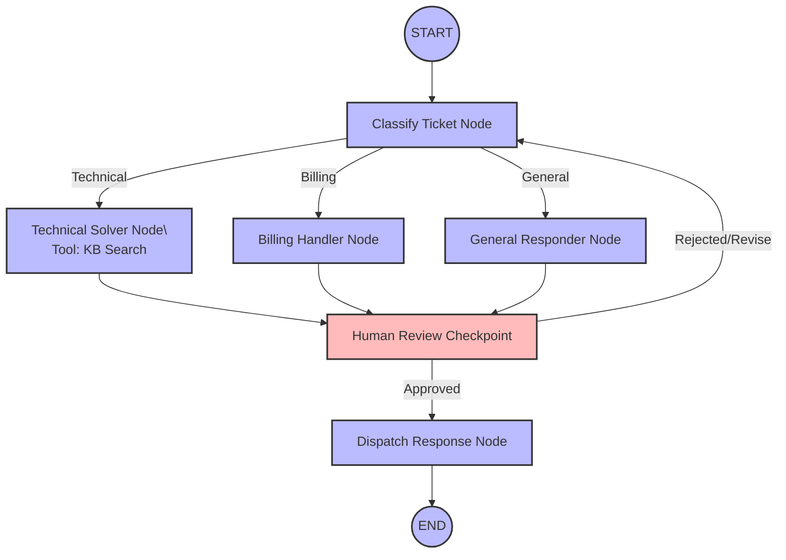

# Week 5 Day 5 Capstone: System Design

**Use Case:** Support Ticket Triage Agent
**Scenario:** An enterprise support pipeline that categorizes incoming tickets, automatically attempts to draft solutions for technical issues by searching a knowledge base, routes billing issues to a human for compliance, and intercepts outgoing automated responses for a final human review before dispatch.

---

## Architecture Diagram

---

## Framework Choice & Justification

**Framework Chosen:** LangGraph

A support ticket triage system requires strict, deterministic routing based on ticket category, robust state persistence for asynchronous human-in-the-loop approvals (e.g., for billing authorizations or final draft reviews), and cyclic edges for self-correction if a draft is rejected. LangGraph natively excels at explicit control flow and checkpointer-based persistence, which are critical for a secure and predictable enterprise ticketing pipeline. Relying solely on a framework like CrewAI, which uses emergent, conversational routing among agents, would be too unpredictable and hard to control for strict operational SLAs.
